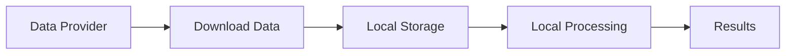
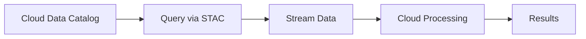

# Introduction to Cloud Native Remote Sensing

## Overview

Cloud-native remote sensing represents a paradigm shift in how we work with Earth observation data. This approach leverages modern cloud computing infrastructure and optimized data formats to enable efficient processing of massive satellite imagery datasets.

## The Evolution of Remote Sensing Workflows

### Traditional Approach



**Challenges:**

- Large download times (hours to days)
- Significant storage requirements (terabytes)
- Limited by local compute resources
- Difficult to share and reproduce

### Cloud-Native Approach



**Benefits:**

- Instant data access
- Minimal storage needs
- Scalable compute
- Easy sharing and collaboration

## Core Concepts

### 1. Analysis-Ready Data (ARD)

Analysis-ready data is satellite imagery that has been processed to a minimum set of requirements and organized so it can be analyzed immediately:

- **Geometric Correction**: Orthorectified and georeferenced
- **Radiometric Calibration**: Converted to surface reflectance
- **Cloud Masking**: Quality flags included
- **Tiled and Indexed**: Organized for efficient access

### 2. Cloud-Optimized Formats

#### Cloud Optimized GeoTIFF (COG)

- Regular GeoTIFF with internal tiling
- Supports HTTP range requests
- Enables partial file reading

#### Zarr

- Chunked, compressed N-dimensional arrays
- Cloud-native storage format
- Parallel read/write operations
- Works seamlessly with Dask

### 3. STAC (SpatioTemporal Asset Catalog)

STAC provides a common language to describe geospatial information:

**Core Components:**

- **Items**: Individual assets (e.g., a single satellite scene)
- **Catalogs**: Collections of items
- **Collections**: Groups of related items
- **API**: RESTful interface for searching

### 4. Lazy Evaluation

Process data only when needed:

```python
# This doesn't load data into memory
ds = xr.open_dataset('large_file.nc', chunks={'time': 10})

# Computation is lazy
result = ds.mean(dim='time')

# Data is loaded and processed only when needed
result.compute()
```

## Key Technologies Stack

### Data Discovery

- **STAC**: Find and access data
- **pystac-client**: Python client for STAC APIs

### Data Access

- **XArray**: Multi-dimensional labeled arrays
- **rioxarray**: Geospatial extensions for XArray
- **XEE**: Earth Engine integration

### Computation

- **Dask**: Parallel computing
- **NumPy**: Array operations
- **Pandas**: Tabular data

### Storage

- **Zarr**: Cloud-optimized arrays
- **COG**: Cloud-optimized GeoTIFF
- **NetCDF**: Self-describing data format

### Visualization

- **Matplotlib**: Static plots
- **Hvplot**: Interactive visualizations
- **Folium**: Interactive maps

## Common Use Cases

### 1. Time Series Analysis

Monitor changes over time across large areas:

```python
# Load multi-year Sentinel-2 data
ds = xr.open_dataset('s2_timeseries.zarr', chunks='auto')

# Calculate monthly NDVI
ndvi = (ds.nir - ds.red) / (ds.nir + ds.red)
monthly_ndvi = ndvi.resample(time='1M').mean()

# Compute trends
trend = monthly_ndvi.polyfit(dim='time', deg=1)
```

### 2. Large Area Mapping

Process continental or global datasets:

```python
# Process data in parallel using Dask
from dask.distributed import Client

client = Client()  # Start local cluster

# Load data with chunking
ds = xr.open_zarr('global_landcover.zarr')

# Process in parallel
result = ds.groupby('time.year').mean().compute()
```

### 3. Multi-sensor Fusion

Combine data from different satellites:

```python
# Load Sentinel-2 optical data
s2 = xr.open_dataset('sentinel2.nc')

# Load Sentinel-1 radar data
s1 = xr.open_dataset('sentinel1.nc')

# Align and combine
combined = xr.merge([s2, s1], join='inner')
```

## Advantages of Cloud-Native Approach

### Performance

- **Parallel Processing**: Utilize multiple cores/machines
- **Lazy Evaluation**: Process only what's needed
- **Optimized I/O**: Read only required chunks

### Scalability

- **Elastic Compute**: Scale up/down as needed
- **Distributed Processing**: Handle datasets larger than memory
- **Cloud Storage**: Unlimited storage capacity

### Collaboration

- **Reproducible**: Share code and environment
- **Accessible**: Run anywhere with internet
- **Version Control**: Track changes with Git

### Cost-Effectiveness

- **Pay-per-use**: Only pay for what you use
- **No Infrastructure**: No need for local servers
- **Shared Resources**: Leverage public datasets

## Getting Started Checklist

- [ ] Understand basic Python programming
- [ ] Familiarize yourself with NumPy and Pandas
- [ ] Learn basic remote sensing concepts
- [ ] Set up Google Colab account (free)
- [ ] Review coordinate systems and projections
- [ ] Understand raster data structures

## Learning Objectives

By the end of this course, you will be able to:

1. **Discover** satellite imagery using STAC catalogs
2. **Access** cloud-hosted datasets efficiently
3. **Process** large-scale Earth observation data
4. **Analyze** time series and multi-temporal datasets
5. **Visualize** results effectively
6. **Scale** your analysis from local to cloud
7. **Optimize** workflows for performance
8. **Share** reproducible analysis

## Next Steps

Now that you understand the fundamentals, let's set up your environment:

→ Continue to [Setup Environment](setup.md)

## Additional Resources

- [XArray Documentation](https://docs.xarray.dev/)
- [STAC Specification](https://stacspec.org/)
- [Dask Documentation](https://docs.dask.org/)
- [Zarr Documentation](https://zarr.readthedocs.io/)
- [Pangeo Community](https://pangeo.io/)

## Key Takeaways

!!! success "Remember"
    - Cloud-native workflows enable analysis at unprecedented scales
    - STAC standardizes data discovery across providers
    - XArray provides intuitive interfaces for N-dimensional data
    - Dask enables parallel and distributed computing
    - Zarr optimizes data storage and access in the cloud
    - Lazy evaluation minimizes data transfer and computation
